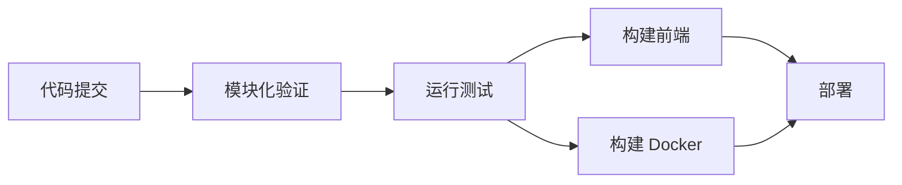
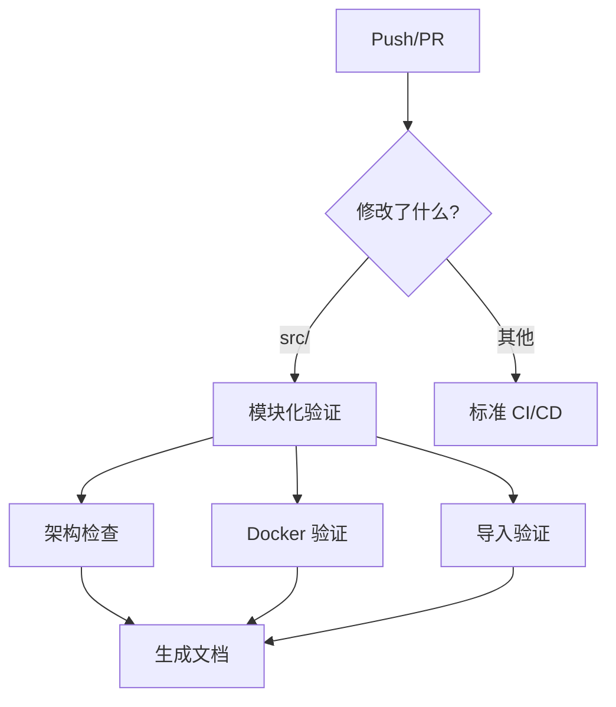

# CI/CD 更新说明

## 更新概述

为适配模块化架构重构，已更新 CI/CD 配置文件。

## 更新内容

### 1. 主 CI/CD 流程 (ci-cd.yml)

**更新项：**
- ✅ 添加 `NODE_ENV=test` 环境变量
- ✅ 测试步骤中添加模块化架构说明
- ✅ 确保使用正确的 server.js 文件

**影响：**
- 测试将使用模块化服务器架构
- 环境变量配置更完整
- 构建和部署流程保持不变

### 2. 新增模块化架构验证 (module-validation.yml)

**功能：**
- ✅ 验证模块化目录结构
- ✅ 验证服务器文件是否为模块化版本
- ✅ 验证路由注册完整性
- ✅ 验证中间件和控制器
- ✅ 检查 Docker 构建配置
- ✅ 验证 ES 模块导入语法
- ✅ 生成架构文档

**触发条件：**
- Push 到 main/develop/refactor/** 分支
- Pull Request 到 main/develop
- 修改 src/、server.js、Dockerfile 时
- 手动触发

### 3. 健康检查流程 (health-check.yml)

**状态：** 无需更新
- 健康检查与服务器架构无关
- 继续监控生产环境状态

## 验证项目

### 架构验证

1. **目录结构检查**
   ```
   src/
   ├── config/
   ├── controllers/
   ├── middleware/
   ├── routes/
   └── services/
   ```

2. **服务器文件验证**
   - 确认 server.js 包含 `registerRoutes`
   - 确认不存在 server-new.js

3. **路由注册验证**
   - 检查所有 *.routes.js 文件
   - 验证是否在 src/routes/index.js 中注册

4. **中间件验证**
   - 验证 auth.js 存在并正确导出
   - 检查其他中间件文件

5. **控制器和服务验证**
   - 统计控制器数量
   - 统计服务数量

### Docker 验证

1. **Dockerfile 检查**
   - 确认使用 `COPY server.js`
   - 确认不使用 `server-new.js`

2. **镜像构建测试**
   - 构建测试镜像
   - 验证镜像内容

3. **镜像内容验证**
   - 检查 server.js 存在
   - 检查 src/ 目录存在

### 模块导入验证

1. **ES 模块语法**
   - 检查是否使用 `import/export`
   - 警告 CommonJS `require` 使用

2. **导入路径**
   - 验证 .js 扩展名
   - 检查相对路径正确性

3. **服务器启动测试**
   - 尝试加载 server.js
   - 验证无语法错误

## 工作流程

### 开发流程



### 验证流程



## 环境变量

### 测试环境

```bash
NODE_ENV=test
DB_HOST=localhost
DB_PORT=5432
DB_NAME=edumaster_test
DB_USER=test_user
DB_PASSWORD=test_password
JWT_SECRET=test_jwt_secret_key_for_ci
```

### 生产环境

通过 GitHub Secrets 配置：
- `SSH_PRIVATE_KEY` - SSH 私钥
- `SERVER_HOST` - 服务器地址
- `SERVER_USER` - 服务器用户
- `DEPLOY_PATH` - 部署路径

## 常见问题

### Q1: 模块化验证失败？

**检查项：**
1. 确认 server.js 是模块化版本
2. 确认 src/ 目录结构完整
3. 确认所有路由已注册
4. 确认中间件正确导出

**解决方案：**
```bash
# 本地验证
npm test
npm run build

# 检查文件
ls -la src/
cat server.js | grep registerRoutes
```

### Q2: Docker 构建失败？

**检查项：**
1. Dockerfile 是否使用正确的文件名
2. .dockerignore 是否排除了必需文件
3. 依赖是否完整

**解决方案：**
```bash
# 本地构建测试
docker build -t edumaster:test .
docker run --rm edumaster:test ls -la /app
```

### Q3: 导入验证警告？

**常见警告：**
- 使用了 CommonJS require
- 导入路径缺少 .js 扩展名

**解决方案：**
```javascript
// ❌ 错误
const express = require('express');
import something from './module';

// ✅ 正确
import express from 'express';
import something from './module.js';
```

### Q4: 测试失败？

**检查项：**
1. 环境变量是否正确
2. 数据库是否初始化
3. 模块导入是否正确

**解决方案：**
```bash
# 本地运行测试
npm test

# 查看详细输出
npm test -- --verbose

# 运行特定测试
npm test -- tests/integration/ai.api.test.js
```

## 最佳实践

### 1. 提交前检查

```bash
# 运行测试
npm test

# 构建前端
npm run build

# 本地 Docker 构建
docker build -t edumaster:local .
```

### 2. 分支策略

- `main` - 生产环境，触发完整 CI/CD
- `develop` - 开发环境，触发测试和构建
- `refactor/**` - 重构分支，触发模块化验证

### 3. Pull Request

- 确保所有检查通过
- 查看模块化验证报告
- 检查架构文档更新

### 4. 部署前验证

```bash
# 检查健康状态
curl https://exammaster.zzzjl.com/api/health

# 查看日志
docker compose logs api --tail 100

# 验证备份
ls -lh /www/backups/edumaster/
```

## 监控和告警

### 自动检查

- ✅ 每日健康检查（UTC 00:00）
- ✅ SSL 证书有效期监控
- ✅ 数据库备份验证
- ✅ API 响应时间监控
- ✅ 页面加载时间监控

### 告警阈值

- API 响应时间 > 1000ms
- 页面加载时间 > 3000ms
- SSL 证书 < 30 天过期
- 备份文件 > 1 天未更新
- 备份文件 < 1MB

## 相关文档

- [服务器架构说明](./服务器架构说明.md)
- [Git 同步使用指南](./Git同步使用指南.md)
- [测试文档](../tests/README.md)

## 更新日志

### 2026-01-27
- ✅ 更新 ci-cd.yml 添加 NODE_ENV
- ✅ 创建 module-validation.yml
- ✅ 添加架构验证流程
- ✅ 添加 Docker 验证
- ✅ 添加导入验证
- ✅ 创建本文档

## 技术支持

如果遇到 CI/CD 问题：

1. 查看 GitHub Actions 日志
2. 检查本文档的常见问题
3. 在项目 Issues 中提问
4. 联系维护团队
